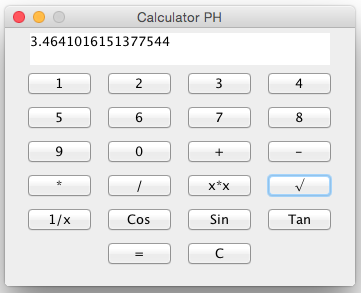

# JavaCalculatior

This calculator is simple with an easy code.

If you use the executable "SimpleJavaCalculator.jar" file and that doesn't work, you can type `java -jar /your_calculator_directory/SimpleJavaCalculator.jar` in your terminal.

